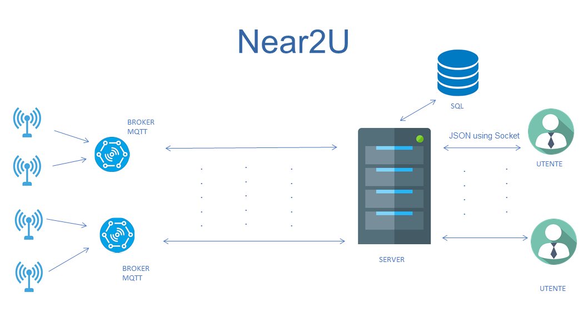

# Near2U

Near2U is a user application to help you interact with your IoT platform of sensors and actuators, using the MQTT protocol.


## Installation

### Install the dependencies used in the client for GUI and for interaction with MQTT functionalities.
In order to do this, a guide is available at the link https://github.com/therecipe/qt/wiki/Installation-on-Linux for the first one, while for the latter install the mqtt package

### mqtt client
```bash
go get github.com/eclipse/paho.mqtt.golang
```

Also, the MQTT package requires the following dependencies

```bash
go get github.com/gorilla/websocket
go get golang.org/x/net/proxy
```
### Install the dependencies used in the server for json,openssl,mysql and for interaction with MQTT functionalities.

### jsoncpp:
```bash
sudo apt-get install libjsoncpp-dev
```
add -ljsoncpp as compile flag

### openssl for SHA auth_token used:

```bash
sudo apt-get install libssl-dev
```

add -lcrypto as compile flag

### mysql connector:

download from https://dev.mysql.com/downloads/connector/cpp/

add -I dir_path/mysql-connector-c++-8.0.19-linux-glibc2.12-x86-64bit/include/jdbc as compile flag substitute dir_path with the correct path

add -pthread as compile flag

add -std=c17++ as compile flag for shared_mutex


### Guides are avaible on links:
 
 - paho mqtt client https://github.com/eclipse/paho.mqtt.cpp , add -l paho-mqtt3c as compile flag

### mysql

install mysql server on your pc


## DB Configuration

enter mysql as root
```bash
sudo mysql -u root -p
```
```bash
CREATE DATABASE apl_project;

GRANT ALL PRIVILEGES ON apl_project.* TO 'admin'@'localhost' IDENTIFIED BY 'admin';

USE apl_project

CREATE TABLE User (
name varchar(30) NOT NULL, 
surname varchar(30) NOT NULL, 
email varchar(50) NOT NULL UNIQUE, 
password varchar(30) NOT NULL, 
auth_token varchar(50), 
Admin boolean,
ID int NOT NULL PRIMARY KEY AUTO_INCREMENT);

CREATE TABLE Ambiente (
name varchar(30) NOT NULL,  
cod_ambiente varchar(40) not null  ,
primary key (cod_ambiente)
);

CREATE TABLE Ambiente_User(
    cod_ambiente varchar(40) NOT NULL,
    User_email varchar(50) NOT NULL,
    FOREIGN KEY (cod_ambiente) References Ambiente (cod_ambiente) on delete cascade on update cascade,
    FOREIGN KEY (User_email) References User (email) on delete cascade on update cascade,
    primary key (cod_ambiente,User_email)
);


delimiter //
create procedure Ambiente_insert (Ambiente_name varchar(30), email varchar(50), cod varchar(40))
begin
    
insert into Ambiente (name,cod_ambiente) values (Ambiente_name,cod);
insert into Ambiente_User (cod_ambiente,User_email) values (cod,email);
end//

delimiter ;

CREATE TABLE Dispositivo (
name varchar(30) NOT NULL,  
type varchar(30) NOT NULL,
code int NOT NULL PRIMARY KEY,
cod_ambiente varchar(40) NOT NULL,
FOREIGN KEY (cod_ambiente) References Ambiente (cod_ambiente) on delete cascade on update cascade
);


CREATE TABLE Sensore (
code int,
FOREIGN KEY (code) References Dispositivo (code) on delete cascade on update cascade,
primary key (code)
);

CREATE TABLE Attuatore (
code int,
FOREIGN KEY (code) References Dispositivo (code) on delete cascade on update cascade,
primary key (code)
);

CREATE TABLE Comandi (

comando varchar(30) NOT NULL,
cod_attuatore int,
FOREIGN KEY (cod_attuatore) References Attuatore (code) on delete cascade on update cascade,
primary key(comando,cod_attuatore)
);


```

## Running


To run the client, is sufficient to execute the Go command

```bash
go run main.go
```
Run the mqtt broker

```bash
mosquitto -p 8082
```

to run the server compile and link:

```bash
g++ -o server   -I dir_path/mysql-connector-c++-8.0.19-linux-glibc2.12-x86-64bit/include/jdbc  main.cpp Thread_Pool.cpp Controller.cpp Ambiente.cpp User.cpp SHA_CRYPTO.cpp MYSQL.cpp Sensore.cpp  Dispositivo.cpp Attuatore.cpp function_mqtt.cpp -lmysqlcppconn -ljsoncpp -lcrypto  -pthread  -l paho-mqtt3c

```
then execute:

```bash
./server
```


however the executable file is avaible
